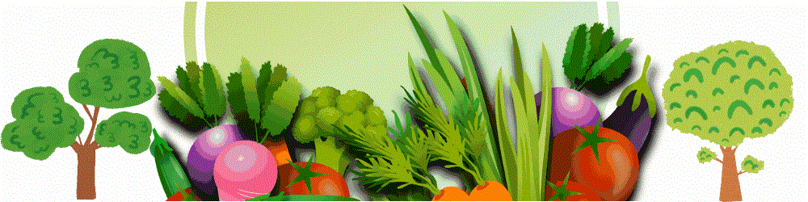
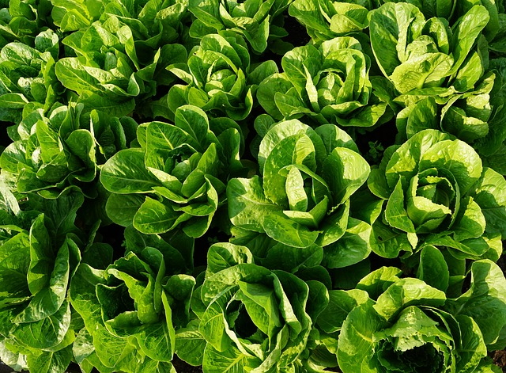
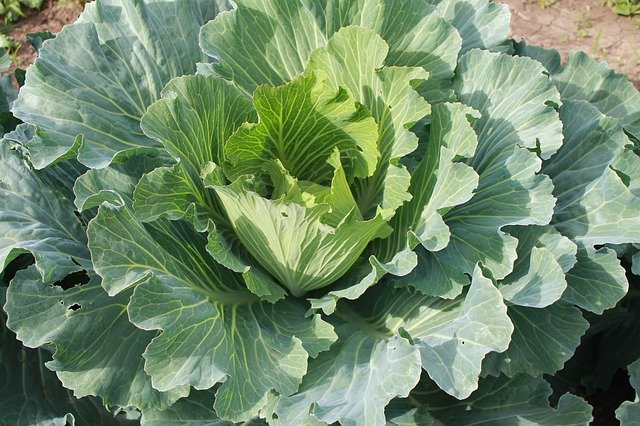
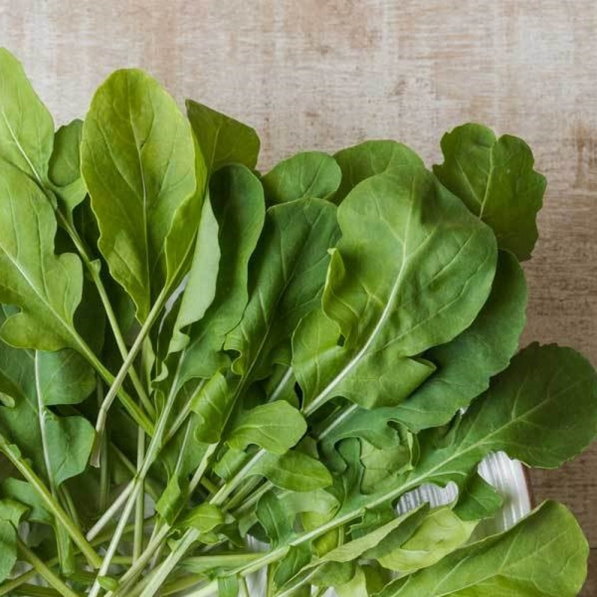
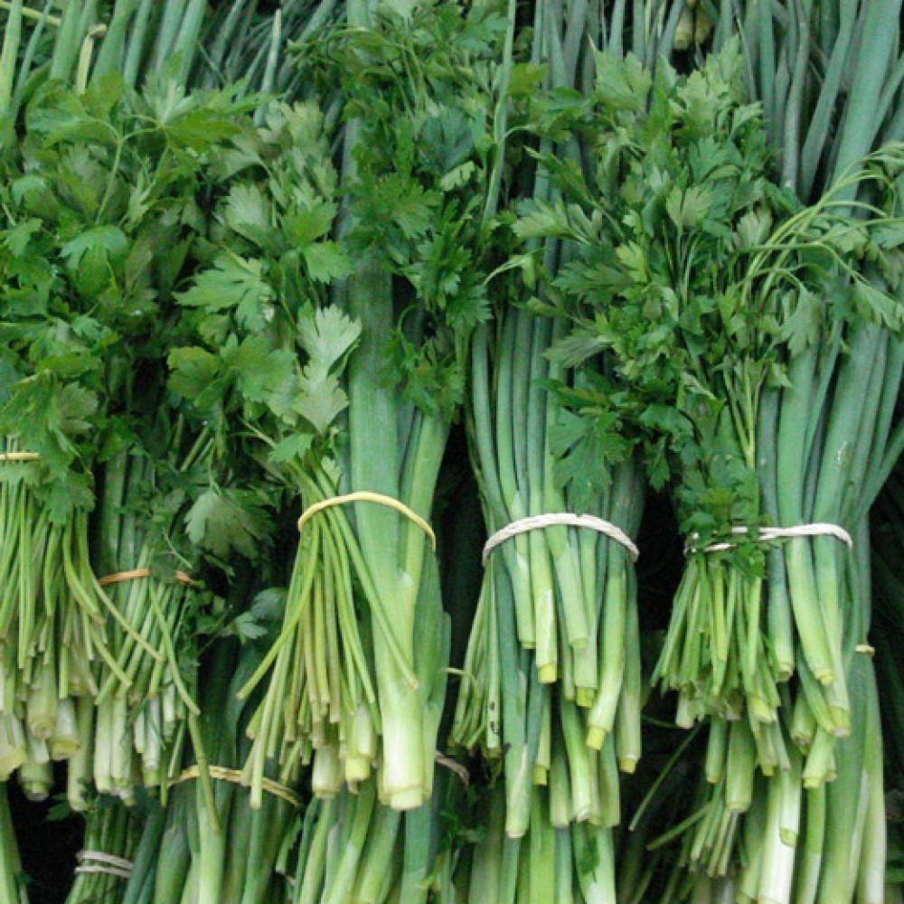
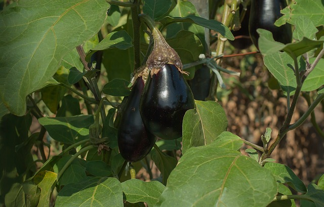
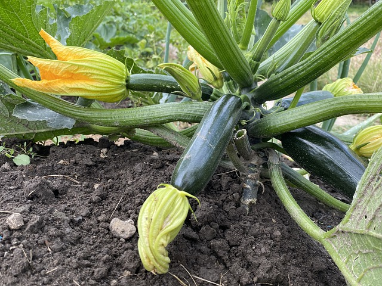
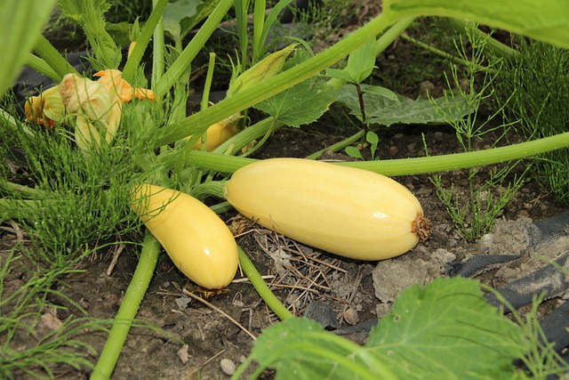
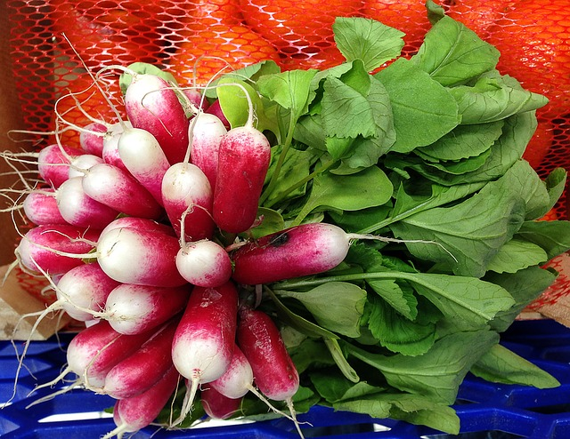

<DOCTYPE html>
<html lang="pt-br">
<head>
    <title > Cantinho Orgânico </title>
    <meta charset="utf-8"/>
    <meta name="author" content="Gabriel Peixoto"/>
    <meta name="Keywords" content="horta, organigcos, folhagens, alface, " />
    <meta name="description" content="Horta orgânica, produtos orgânicos"/>
</head>

    

      
         <a href="#pginicio" >&nbsp; HOME &nbsp;</a>
         <a href="#pghortalicas" href="#pglegumes" >&nbsp; PRODUTOS &nbsp;</a>
         <a href="#pgctt">&nbsp; CONTATO &nbsp;</a> 
         <a href="encomendas.html">&nbsp;ENCOMENDAS&nbsp;</a>     
      
    

   
<body link="#388E3C" alink="#388E3C" vlink="#388E3C" >
   
   
    
      <h1 align="left">CANTINHO ORGÂNICO</h1>
     

    
   
   
        
 &nbsp;&nbsp;&nbsp;&nbsp;&nbsp;Na <b>Cantinho Orgânico</b>, acreditamos que a 
          mudança começa pelo nosso prato. Ao escolher nossos produtos orgânicos, você está alimentando o 
          desenvolvimento de um pequeno agricultor familiar, onde preservamos a qualidade do solo e da água 
          também a biodiversidade brasileira. Alimentos orgânicos são aqueles produzidos sem uso de agrotóxicos 
          sintéticos, transgênicos ou fertilizantes químicos, são alimentos saudáveis que cuidam do nosso corpo, 
          e tem mais durabilidade. As técnicas do processo de produção respeitam o meio ambiente, a saúde do 
          trabalhador agrícola, a do consumidor e têm como objetivo manter a qualidade do alimento. 

   

       
            <h3> Hortaliças </h3>
       

      <table border="0"> 
           <tr align="center">
             <td>  </td>       
             <td></td>
             <td></td>
             <td></td>
           </tr> 

           <tr align="center">
             <b><th>Alfaces | R$ 4,50 Un </th><b>
             <th>Couve | R$ 4,50 Un </th>
             <th>Rucula | 1,99 Un </th>
             <th>Cheiro Verde | 3,50 Un </th>
           </tr>

           <tr>
             <td align="center" size="1"/>
               <h4> Variedade:</h4>
                
- Crespa  
 
                
- Lisa

                
- Roxa

             </td>

             <td align="center" font size="0"/>
                <h4>Variedade:</h4>
                 
-  Portuguesa

                 
- Chinesa

                 
 - Roxa

            </td>
           </tr>
       </table>
      

                
                <h3> Legumes e Verduras </h3>
                

            
      <table border="0">
           <tr align="center">
              <td></td>
              <td></td>
              <td></td>
              <td></td>
           </tr> 

           <tr align="center">           
             <td>Berinjela | 2,50 Kg</td>
             <td>Abobrinha verde | 1,99 Kg</td>
             <td>Abobrinha amarela | 1,99 Kg</td>
             <td>Rabanete | 2,99 Kg</td>
           </tr>
      </table>
      

  
 
 
        
        
Caso tenha alguma duvida

            
          (61) 98134-4974   
         
   </tr>
</table>

 Desenvolvido por: <a href="https://www.instagram.com/guimaboy" target="_blank">Gabriel Peixoto </a> - 2021  

</body>
</html>
